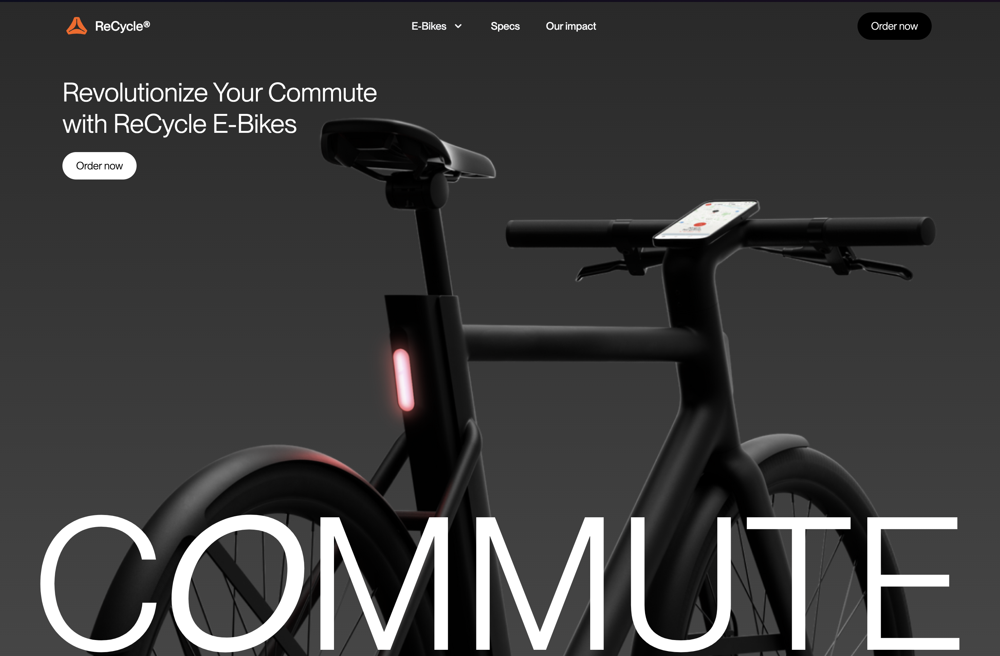
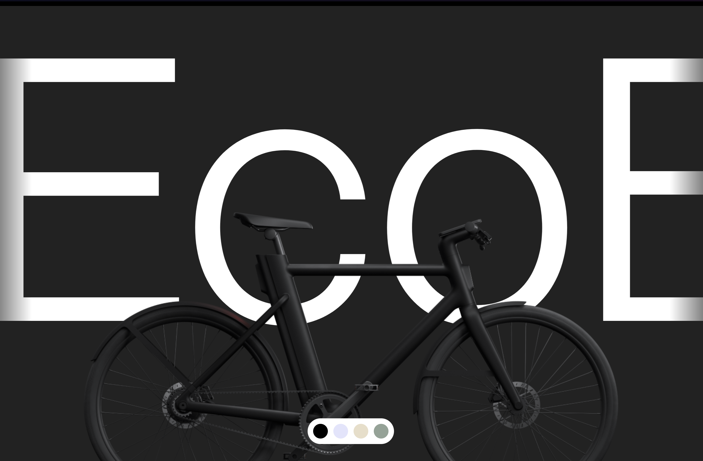
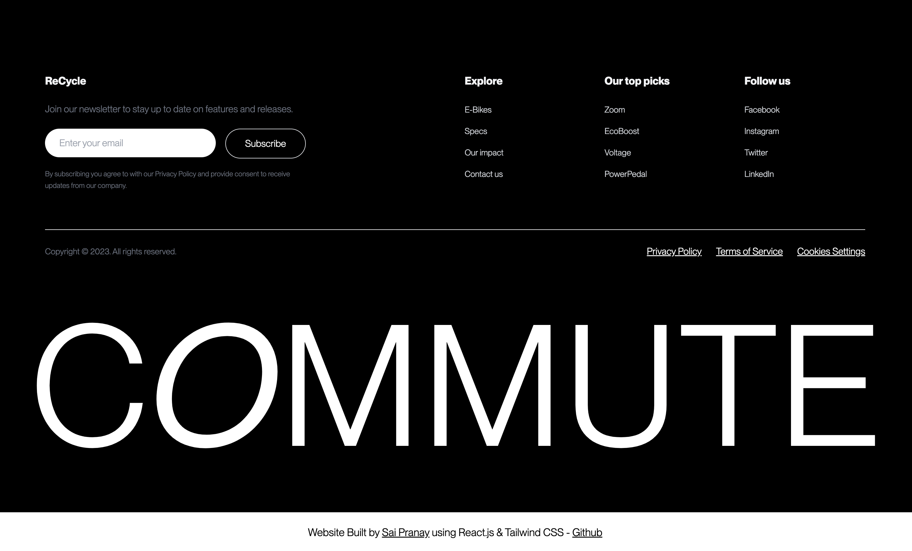

# Recycle - Relume Design League 2 Winning Design

This repository contains the code for my implementation of [Joseph's](https://twitter.com/josephberry88) winning design from the Relume Design League 2. The website is built using React and Tailwind CSS.

## Live Demo:

https://rdl2final.vercel.app/

## Screenshots (few sections of the live demo):





## Figma Design File:

Figma Design File: https://www.figma.com/community/file/1216113412996841002

## Installation:

1. Clone the repository:

```bash
git clone https://github.com/saipranay47/recycle.git
```

2. Install dependencies:

```bash
npm install
```

3. Run the development server:

```bash
npm start
```

4. Open http://localhost:5173 in your browser to view the website.

## Contributing:

Pull requests are welcome. For major changes, please open an issue first to discuss what you would like to change.

## License:

This project is licensed under the MIT License. See the [LICENSE](/LICENSE.txt) file for more information.